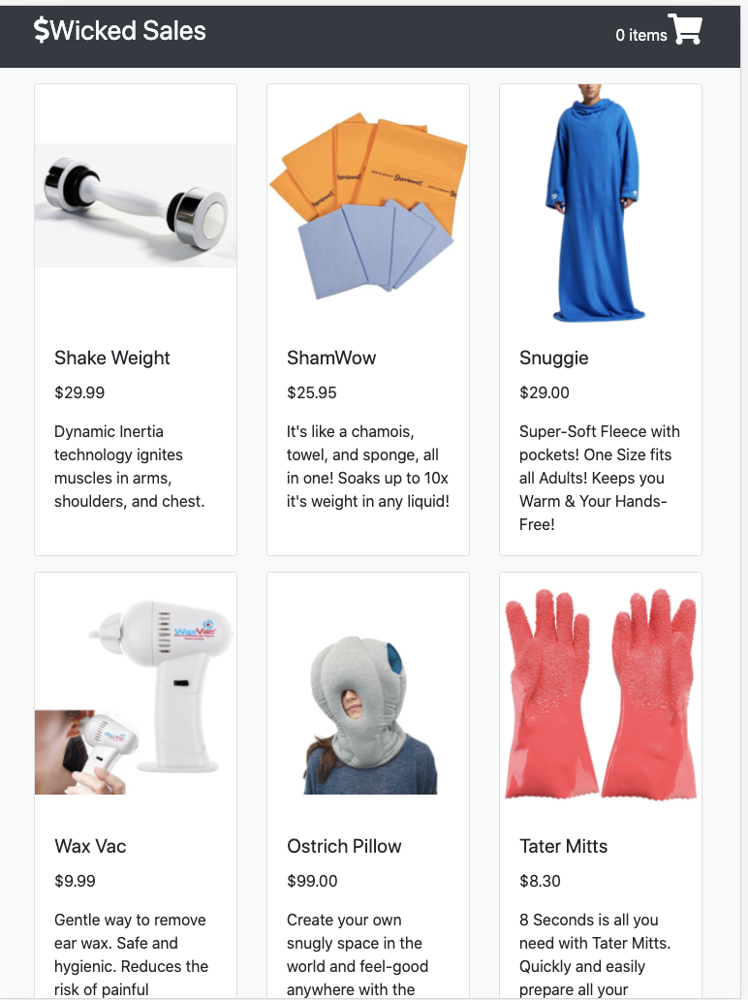

# wicked-sales
A full stack Node.js and react shopping cart app.

## Live Deployment

https://wicked-sales.frankbae.com/

## Technologies Used
- HTML5
- CSS3
- React
- Node.js
- npm
- Webpack 4
- babel
- Boostrap 4
- postgreSQL

## Features
- Users can view products.
- Users can view details of the product.
- Users can add product to shopping cart.
- Users can review their shopping cart.
- Users can checkout their item to a payment form.

## Preview

## Development

### System Requirements
- Node.js 10 or higher
- npm 6 or higher
- postgreSQL

### Getting Started
1. Clone the repository

        git clone https://github.com/Frank-Bae/wicked_sales_js.git
        cd wicked_sales_js

2. Install all dependencies with NPM

        npm install

3. Start PostgreSQL server

        sudo service postgresql start

4. Create database

        createdb wickedSales

5. Import the example database to postgreSQL

        npm run db:import

6. Copy ENV file

        make a env file and copy the file from the env.example
    
7. Start the project. Once started you can view the application by opening http://localhost:3000 in your browser.
        
        npm run dev
